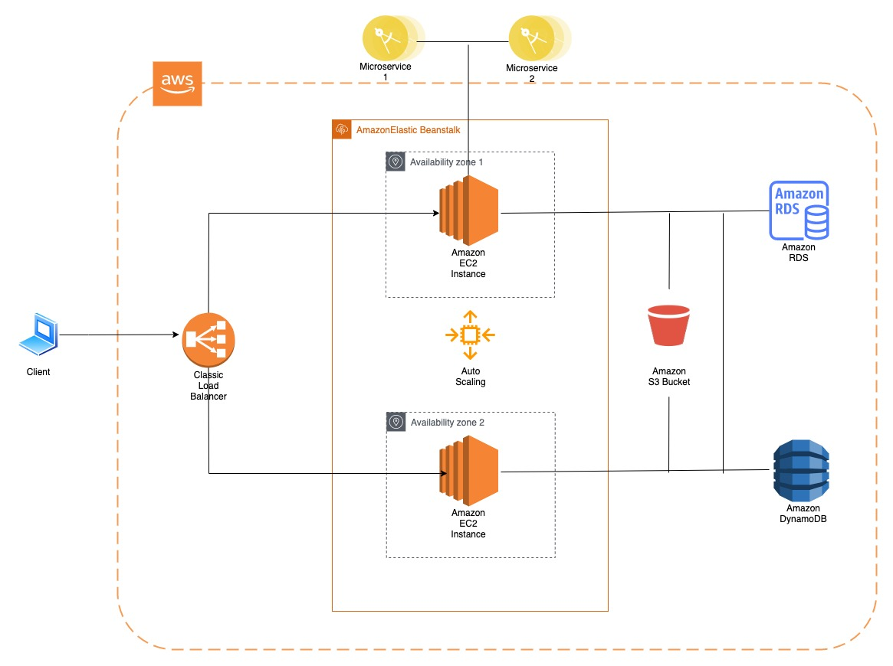

#### Prueba 1 - Diagrama de Red

Produzca un diagrama de red (puede utilizar lucidchart) de una aplicación web en GCP o AWS y escriba una descripción de texto de 1/2 a 1 página de sus elecciones y arquitectura.

El diseño debe soportar:

- Cargas variables
- Contar con HA (alta disponibilidad)
- Frontend en Js
- Backend con una base de datos relacional y una no relacional
- La aplicación backend consume 2 microservicios externos

 
El diagrama debe hacer un mejor uso de las soluciones distribuidas.
---------------------------------------------------------------
DESARROLLO: 

Para el diseño  se utilizó la herramienta draw.io, y se seleccionó AWS para la prueba, a su vez se cargó los gráficos correspondientes en la herramienta.
 La infraestructura presentada permite lograr alta disponibilidad y las cargas variables gracias a Elastic Beanstalk, ya que según la documentación de  Amazon "...Elastic Beanstalk administrará de manera automática la implementación, desde el aprovisionamiento de la capacidad, el equilibrio de carga y el escalado automático hasta la monitorización del estado de la aplicación. Elastic Beanstalk ajusta el escalado de la aplicación automáticamente en función de la necesidad específica de la aplicación, para lo que usa una configuración de Auto Scaling que se puede adaptar con facilidad..." cumpliendo con las necesidades para nuestro caso de uso. Además, el balanceo de cargas, será realizado por un Classic Load Balancer, la especificación del mismo nos dice que "...distribuye automáticamente el trafico entrante a las múltiples objetivos, tales como instancias EC2, contenedores, y direcciones ip, en una o mas Zonas de disponibilidad...". El frontend será desplegado en instancias EC2, situadas en distintas Zonas de disponibilidad (Availability Zones) para garantizar que la aplicación seguirá disponible en caso de caídas de alguna de estas, citando nuevamente la documentación de Amazon:"...Si distribuye las instancias entre varias zonas de disponibilidad y una de las instancias genera un error, puede diseñar la aplicación de forma que una instancia en otra zona de disponibilidad pueda gestionar las solicitudes...". En cuanto al backend, tenemos por un lado la base de datos no relacional, implementada en Amazon DynamoDB dada la facilidad que brinda en cuanto a escalabilidad debido a que se "..aumenta o reduce automáticamente las tablas para ajustar la capacidad y mantener el rendimiento. La disponibilidad y la tolerancia a errores están integradas, por lo que no es necesario tener en cuenta estas capacidades a la hora de diseñar sus aplicaciones. DynamoDB proporciona los modos de capacidad bajo demanda y de capacidad aprovisionada para que pueda optimizar los costos mediante la especificación de la capacidad por carga de trabajo o el pago de los recursos que consume..." según su especificación, permitiéndonos afrontar el requerimiento, mientras que se propone Amazon RDS (Relational Database Sevice) para la relacional, pues la simplicidad que brinda satisface el requerimiento, además de estar disponible para varios tipos de instancia tales como MySQL, PostgreSQL, MYSQL, entre otros. Y por ultimo tenemos el Amazon S3 Bucket, que nos permitirá almacenar todos los códigos de las aplicaciones junto a los registros logs. Todo lo mencionado se aloja en el cloud de AWS.

 
 
 
REFERENCIAS:
https://docs.aws.amazon.com/es_es/elasticloadbalancing/latest/classic/introduction.html
https://aws.amazon.com/es/elasticbeanstalk/
https://aws.amazon.com/es/dynamodb/
https://aws.amazon.com/es/rds/
https://docs.aws.amazon.com/es_es/AWSEC2/latest/UserGuide/using-regions-availability-zones.html#concepts-availability-zones
https://aws.amazon.com/es/s3/
https://aws.amazon.com/es/elasticloadbalancing/classic-load-balancer/
https://aws.amazon.com/es/getting-started/hands-on/deploy-nodejs-web-app/